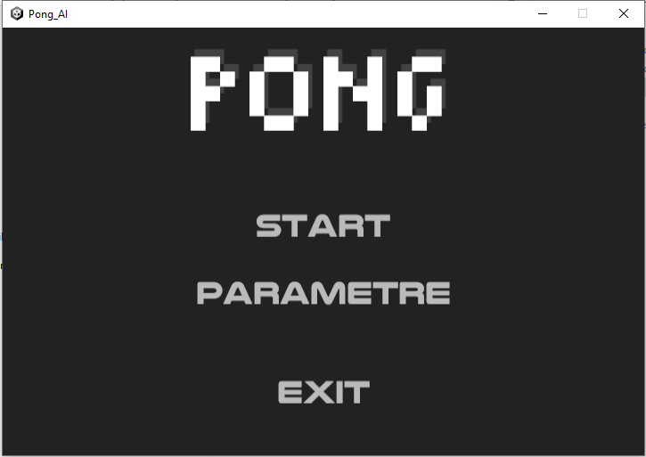
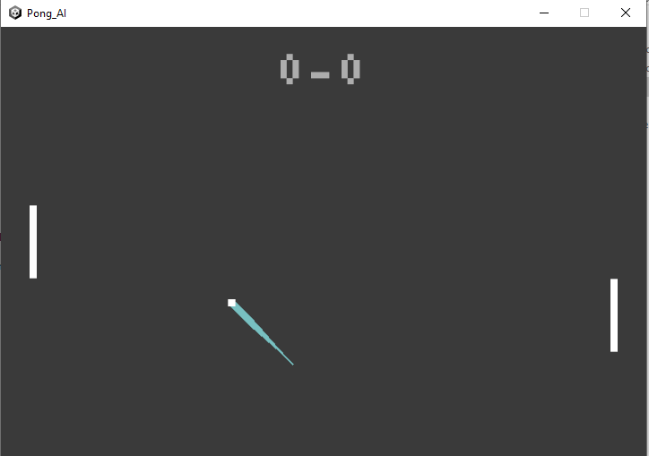

#Jeu Pong (Unity3D/C#)

Projet d'un jeu de Pong développé sous Unity 3D avec le langage de programmation C#. L'objectif cette création de projet et de perfectionner la maitrise du moteur 3D ainsi que du langage C#.
J'explore les fondamentaux du développement de jeux, notamment la gestion des collisions, l'interaction des objets et les mécaniques de jeu classiques en format 2D.

##Les fonctionnalités

- Mécanique de jeu fidèle au Pong original
- Gestion des collisions avec les bordures et les raquettes
- Score dynamique affiché en temps réel
- Contrôle fluide des raquettes
- Effet d'un shakeCamera pour accentuer l'impact

##Mes objectifs dans ce projet
- Approfondir les connaissances en C# appliquées au développement de jeux
- Explorer d'avantage le moteur Unity3D et ses composants essentiels mais cette fois un thème de projet 2D
- Comprendre les principes de la physique et du mouvement en 2D
- Me servir de ce projet comme portefolio

## Quelques captures du jeu



##Installation et exécution du jeu
 **Cloner le repository** :
   ```sh
   git clone https://github.com/TonPseudo/Pong-Unity3D-CSharp.git
